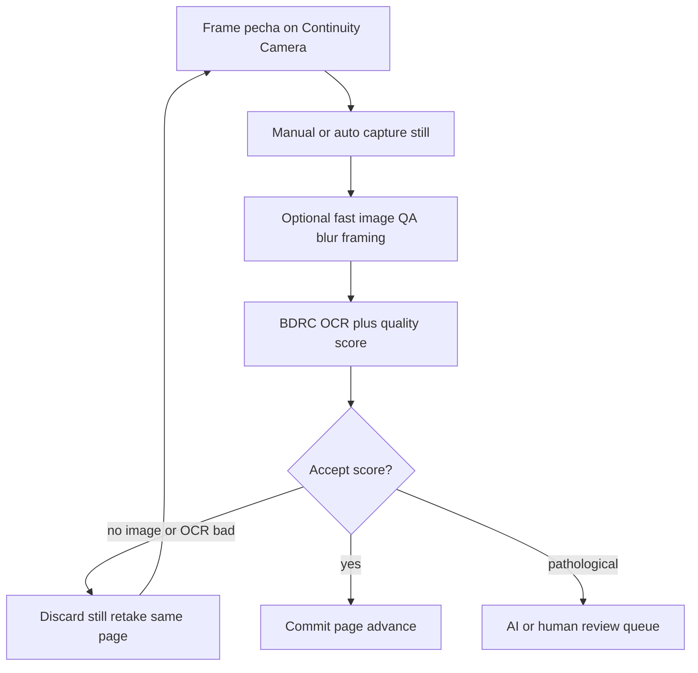

# Live Pecha Capture (Continuity Camera → OCR)

**Status:** Design + spike — not ticketed for product build yet.  
**Companion to:** [INTERACTIVE_OCR_PLAN.md](INTERACTIVE_OCR_PLAN.md)  
**Goal:** Document a frictionless page-by-page capture loop for physical pecha, learn Continuity Camera + per-page OCR latency via a spike, then decide whether to ticket a product UI.

---

## Usecase

You have a physical pecha (often 200+ pages) that needs to become a workable digital file (DOCX / spellchecked text). Today the efficient-looking path is inefficient in practice:

1. Photograph each page on iPhone  
2. Save to Photos / sync via iCloud  
3. Open on Mac  
4. Upload one-by-one (or assemble a PDF offline)

That handoff dominates the session. You already use the iPhone as a Zoom webcam from the Mac — that feature is **Continuity Camera**. The proposed product path is: open the app on the Mac, select the iPhone camera in-browser, capture stills from the live stream, run OCR, and never touch the Photos library.

**Success shape for a book:**

- Most pages: BDRC accepts on the first good frame (local ONNX, no LLM cost).  
- Small percentage: text is special (warped, faded, mixed script, unusual layout) → escalate to the existing interactive OCR AI / human path.  
- Bad frames: retake **the same page** immediately before advancing.

This is the “physical-book photos” future item from the interactive OCR plan, made concrete for Apple Continuity Camera + a live OCR gate.

---

## Decisions (v1)

| Decision | Choice |
| -------- | ------ |
| Device handoff | Continuity Camera → Mac browser `getUserMedia` (not Photos / iCloud / manual upload) |
| Advance gate | **Live OCR gate** — wait for BDRC + quality score on the current page before flipping to the next |
| Pipelining | **Not in v1** — no “frame next while OCR last” (easy to confuse when holding a pecha) |
| Still source | Freeze frame / shutter from the video stream, not a file from the Photos library |
| Escalation | Reuse `ocr_assist` diagnostician / vision / needs_human |
| Autocapture | Optional after spike proves framing + stability heuristics; not required for first spike |

---

## Proposed v1 loop (live OCR gate)

### Loop details

1. **Frame** — iPhone aimed at the pecha leaf; Mac shows live preview.  
2. **Capture** — grab a high-res still from the stream (canvas draw or `ImageCapture` when available).  
3. **Image QA (optional, pre-OCR)** — blur / crop / guide-overlay checks can reject a frame *before* OCR so you don’t burn seconds on an obviously bad shot. This is a retake *hint*, not the advance gate.  
4. **OCR** — BDRC + quality scorer (same thresholds / settings model as interactive OCR).  
5. **Decide on this page only**  
   - Accept → commit page, advance.  
   - Bad image or recoverable OCR fail → discard still, retake.  
   - Pathological → escalate (AI retry / vision / human), then continue.  
6. Repeat until the book is done → DOCX export (existing T-08 path once wired).

### Mapping onto existing architecture

Interactive OCR already thinks in per-page images under the job store (`jobs/<id>/page-NNN/image.png`, settings, attempts). Live capture should:

| Capture action | Job store action |
| -------------- | ---------------- |
| New page still | Write / replace `image.png` for page N |
| Retake | Replace image, clear or append attempt, re-run `run_page` |
| Accept | Finalize page, `N → N+1` |
| Escalate | Existing diagnostician → vision → needs_human |

Product OCR today is PDF-only (`PDFUpload` accept `.pdf`). Image ingest and camera UI are new surfaces; the backend page model does not need reinventing.

---

## Continuity Camera notes

**What it is:** Apple feature that exposes the iPhone camera as a webcam on a nearby Mac (same Apple ID, Bluetooth + Wi‑Fi, Continuity enabled). Wired USB also works if the phone trusts the Mac. Used by FaceTime, Zoom, Photo Booth, and — with caveats — browser `getUserMedia`.

**Not the same as:** Continuity Camera *document import* (“Import from iPhone → Take Photo / Scan Documents” in Finder/Notes). That is a macOS native flow, not available to web apps the same way. This design targets **webcam Continuity Camera**.

**Browser caveats (known / to verify in spike):**

- iPhone often needs the **“magic pose”** for browsers to see or stably stream it: landscape, screen off / locked, motionless (not handheld), camera unobstructed.  
- Device may enumerate but deliver **zero frames** in some Electron / packaged Chromium hosts missing `NSCameraUseContinuityCameraDeviceType`. Safari and Chrome on macOS are the primary spike targets.  
- Wireless Continuity Camera conflicts with AirPlay / Sidecar on the Mac.  
- Only one Continuity Camera session at a time (one iPhone ↔ one Mac).

---

## Latency (honest)

Live OCR gate **will** make the session wait-bound: you hold the pecha on the current page until OCR returns.

- Autocapture and image QA only reduce **wasted** waits on bad frames. They do not remove the successful-page OCR cost.  
- Wall-clock for ~200 pages = `(per-page OCR time + human framing/retake time) × pages`, once measured. **Do not invent a number** — fill in after the spike (§ Spike results).  
- Revisit hybrid / async pipelines **only after** live gate feels too slow in a real multi-page sitting.

---

## Non-goals (this phase)

- Full interactive OCR UI (T-09) or production camera routes.  
- Mobile PWA capture *on the phone* (opposite direction from Continuity Camera).  
- Batch PDF upload changes or `combine_to_pdf` replacement.  
- Choosing Anthropic vs Gemini for phone photos (existing vision provider abstraction covers escalation).  
- Ticketed product build plan — that comes after spike notes land.

---

## Spike checklist

**Purpose:** Learn Continuity Camera reliability, still quality vs BDRC needs, and per-page wait time in one sitting. Prefer the fastest throwaway surface (static HTML page or a local-only Next.js route). No product UI.

**Prerequisites**

- [ ] iPhone XR+ (iOS 16+), Mac (Ventura+), same Apple ID  
- [ ] Continuity Camera on: iPhone Settings → General → AirPlay & Continuity  
- [ ] Bluetooth + Wi‑Fi on; Mac not using AirPlay/Sidecar  
- [ ] Backend OCR models available if timing BDRC (`python scripts/download_models.py`)

### 1. Device enumeration

- [ ] In **Safari** and **Chrome** on Mac, request camera permission and call `navigator.mediaDevices.enumerateDevices()`.  
- [ ] Confirm a `videoinput` whose label looks like the iPhone appears.  
- [ ] Open a stream with `{ video: { deviceId: { exact: … } } }` (not “default”, which may pick FaceTime HD).

**Notes:** _(fill in)_

| Browser | iPhone listed? | Stream OK? |
| ------- | -------------- | ---------- |
| Safari  |                |            |
| Chrome  |                |            |

### 2. Preview + still capture

- [ ] Show live `<video>` preview from the Continuity Camera device.  
- [ ] Capture a still (canvas `drawImage` + `toBlob`, or `ImageCapture.takePhoto()` if available).  
- [ ] Save locally (download) and optionally POST later to a throwaway endpoint.

**Notes:** _(fill in)_

- Capture method used:  
- Still dimensions (W×H):  
- File size / format:  

### 3. Magic-pose / failure modes

For each condition, note whether preview works, stream stalls, or device disappears:

| Condition | Result |
| --------- | ------ |
| Phone in magic pose (landscape, locked, stable) | |
| Phone handheld / moving | |
| Phone screen on / unlocked | |
| Bluetooth off | |
| Wi‑Fi off | |
| Mac AirPlay / Sidecar active | |
| Device listed but zero video frames | |

**Notes:** _(fill in)_

### 4. Resolution / DPI vs pecha readability

BDRC in this repo is tuned around ~300 DPI PDF renders. Phone stills are resolution-in-pixels, not DPI — effective DPI depends on leaf size and camera distance.

- [ ] Photograph one pecha leaf filling a guide overlay (approx pecha aspect).  
- [ ] Visually judge whether glyphs look sharp enough for OCR at that distance.  
- [ ] Record still dimensions and approximate physical leaf size / distance if known.  
- [ ] Note whether desk-distance guidance or upscaling seems necessary before BDRC.

**Notes:** _(fill in)_

### 5. Latency baseline (live OCR gate)

Time one pecha-like page end-to-end:

1. Capture still  
2. Run BDRC OCR (CLI `ocr_assist` on a one-page PDF/image, or engine directly)  
3. Quality score  

| Metric | Value |
| ------ | ----- |
| Capture → still ready (ms) | |
| Still → OCR + score (ms) | |
| Total gate wait (ms) | |
| Subjective flip-rhythm feel (1–5) | |

Rough 200-page projection (fill after measuring):  
`200 × (gate wait + framing seconds) ≈ ____ minutes` (human framing estimated separately).

**Notes:** _(fill in)_

### 6. Autocapture probe (optional)

- [ ] Overlay a pecha-shaped guide on the preview.  
- [ ] Detect frame stability over N consecutive frames (e.g. low motion / Laplacian variance above threshold).  
- [ ] Note false triggers (shadows, hands, turning the leaf).  
- [ ] Do **not** build product autocapture logic yet — record observations only.

**Notes:** _(fill in)_

---

## Spike results

_Fill after running the checklist. Goal: decide whether to ticket a product capture UI or adjust the live OCR gate._

| Question | Answer |
| -------- | ------ |
| Continuity Camera reliable enough in Safari/Chrome? | |
| Still quality adequate for BDRC without heavy preprocess? | |
| Per-page wait acceptable for a 200-page sitting? | |
| Autocapture worth pursuing next? | |
| Open questions / blockers | |

**Next step after spike:** new chat to turn confirmed constraints into tickets (capture UI, image ingest API, retake action on `ocr_assist` pages), or revise the gate if wait time is unacceptable.

---

## Relationship to interactive OCR plan

- Extends **Physical-book photos** under Future / not yet ticketed in [INTERACTIVE_OCR_PLAN.md](INTERACTIVE_OCR_PLAN.md).  
- Depends conceptually on job store + per-page settings + quality scorer (already implemented).  
- Product capture UI should stay **local-only / behind-flag** until auth and cost caps exist for any AI escalation — same deployment posture as T-09 / AI assist.
